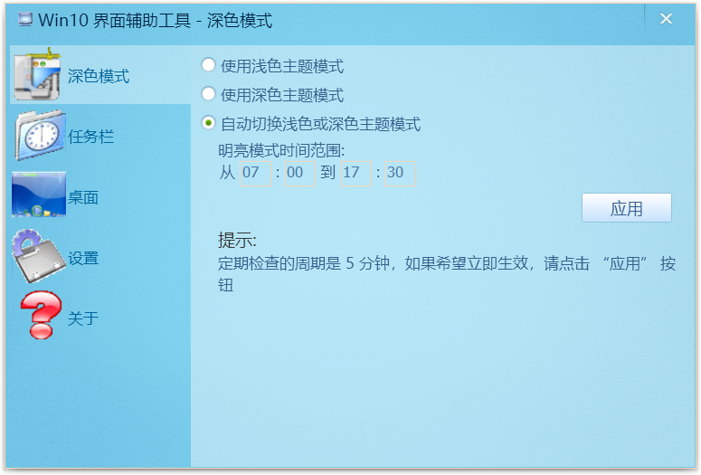

# win10_tools

  Windows 10 interface adjustment tool supports automatic switching of light and dark modes, automatic switching of themes and transparent setting of taskbar

## theme mode setting



## taskbar setting


## desktop theme setting


## options


# complie

## Third party library dependency

win10_ Tools uses the **boost** library as an extension of the standard library, **libiconv** for string encoding, **xconfig2** as the configuration persistence storage scheme, **soui2** as the user interface solution, and **WTL** as a small number of window message crack.

Boost, libiconv, WTL and soui2 are widely known and widely used open source libraries. While Xconfig2 is not, but it is not far away, just here:  https://github.com/inte2000/xconfig2

- boost     1.70
- libIconv  1.16
- soui2     https://github.com/SOUI2/soui
- WTL       10.0.xxxx
- xconfig2  0.1.7

Use Visual Studio 2019 (Community version is OK) to open win10tools.sln, select the corresponding configuration and compile. For the configuration of third-party libraries, it is recommended to use the property sheet files. If you don't know about property sheet configuration, here is an article on how to use property sheet files to simplify the use of third-party libraries:

https://blog.csdn.net/orbit/article/details/120996357


## Modify on SOUI2

 Third party libraries are not included in this repository. Other libraries but SOUI2 can directly use their latest versions to compile. You can pull the latest code of souI 2 from the above link, but you still need to make some changes to work with win10_ Tools. 

Firstly,  you need to modify the library utilities.dll and add two export functions. It is recommended to put them in the file utilities.cpp. 

```c++
    int UTILITIES_API ScaleFromSystemDpi(UINT dpi);
    UINT UTILITIES_API GetSystemDeviceDpi();

    int ScaleFromSystemDpi(UINT dpi)
    {
        int nScale = dpi * 100 / 96;
        return nScale;
    }
    
    UINT GetSystemDeviceDpi()
    {
        HDC hDCScreen = GetDC(NULL);
        UINT dpiX = GetDeviceCaps(hDCScreen, LOGPIXELSX);
        UINT dpiY = GetDeviceCaps(hDCScreen, LOGPIXELSY);
        ReleaseDC(NULL, hDCScreen);
    
        return dpiY;
    }
```

Secondly, modify the swing class and add a member variable:

```c++
BOOL m_bUsingSolidBkgnd
```

and three member functions:

```c++
void SWindow::SetBkgndColor(COLORREF color, BOOL bUpdate)
{
	SStringW strColor;
	strColor.Format(L"rgb(%u, %u, %u)", GetRValue(color), GetGValue(color), GetBValue(color));
	SetAttribute(L"colorBkgnd", strColor, bUpdate);
}

COLORREF SWindow::GetBkgndColor() const
{
	return GetStyle().GetBkgndColor();
}

void SWindow::SetForceSolidBkgnd(BOOL bUsingSolidBkgnd, BOOL bUpdate)
{
	m_bUsingSolidBkgnd = bUsingSolidBkgnd;
	if (bUpdate)
		Invalidate();
}
```

Finally, don't forget to modify the OnEraseBkgnd function, like this:

```c++
BOOL SWindow::OnEraseBkgnd(IRenderTarget *pRT)
{
    CRect rcClient=GetClientRect();
    if (!m_pBgSkin || m_bUsingSolidBkgnd)  //here is ...
    {
        COLORREF crBg = m_style.m_crBg;
			
```


